# Pokédex TypeScript Lite

## Sobre o projeto

O **Pokédex TypeScript Lite** é uma aplicação back-end simples desenvolvida com **Node.js** e **TypeScript**.

A aplicação consulta dados de Pokémon na **PokeAPI**, transforma a resposta recebida em um objeto simplificado e organiza os Pokémon em um catálogo local salvo no arquivo `pc_box.json`.

O projeto é executado pelo terminal e não possui interface gráfica. A demonstração do funcionamento é feita a partir do arquivo `src/main.ts`, que inicia o fluxo principal por meio do `TerminalController`.

---

## Objetivo

O objetivo do projeto é praticar os principais conceitos estudados no Módulo 01 de desenvolvimento back-end:

* Node.js;
* JavaScript no back-end;
* TypeScript;
* interfaces;
* funções tipadas;
* arrays;
* objetos;
* JSON;
* métodos de array;
* classes;
* métodos de classes;
* modificadores de acesso;
* funções assíncronas;
* Promises;
* async/await;
* fetch;
* tratamento de erros;
* organização em camadas;
* persistência local com arquivo JSON;
* Git;
* GitHub;
* GitFlow;
* Kanban.

---

## Tecnologias utilizadas

* Node.js
* TypeScript
* TSX
* PokeAPI
* Git
* GitHub

---

## Pré-requisitos

Antes de executar o projeto, é necessário ter instalado:

* Node.js;
* npm;
* Git.

Para verificar se o Node.js e o npm estão instalados, execute:

```bash
node -v
npm -v
```

---

## Como instalar

Clone o repositório:

```bash
git clone https://github.com/jeanmpl/pokedex-typescript-lite.git
```

Acesse a pasta do projeto:

```bash
cd pokedex-typescript-lite
```

Instale as dependências:

```bash
npm install
```

Esse comando lê o arquivo `package.json` e instala automaticamente as dependências necessárias para executar e compilar o projeto.

As principais dependências de desenvolvimento utilizadas são:

* `typescript`: compila os arquivos TypeScript;
* `tsx`: executa o projeto em desenvolvimento;
* `@types/node`: fornece tipos do Node.js para o TypeScript.

---

## Como executar

Para executar o projeto em ambiente de desenvolvimento:

```bash
npm run dev
```

Para compilar o projeto:

```bash
npm run build
```

Para executar a versão compilada:

```bash
npm run start
```

Observação: o comando `npm run start` executa o arquivo compilado em `dist/main.js`. Portanto, antes de usá-lo, execute `npm run build`.

---

## Estrutura do projeto

```txt
pokedex-typescript-lite/
│
├── assets/
│   └── images/...│       
│
├── src/
│   ├── main.ts
│   │
│   ├── controllers/
│   │   └── TerminalController.ts
│   │
│   ├── models/
│   │   ├── Pokemon.ts
│   │   └── CustomErrors.ts
│   │
│   ├── services/
│   │   ├── PokeApi.ts
│   │   └── CatalogoPokemon.ts
│   │
│   └── utils/
│       └── formatarPokemon.ts
│
├── pc_box.json
├── package.json
├── tsconfig.json
└── README.md
```

---

## Funcionalidades

A aplicação possui as seguintes funcionalidades:

* buscar Pokémon por nome ou ID na PokeAPI;
* tratar erro de Pokémon inexistente;
* tratar busca vazia ou inválida;
* transformar a resposta da API em um objeto simplificado;
* adicionar Pokémon ao catálogo local;
* impedir Pokémon duplicado pelo mesmo ID;
* listar os Pokémon salvos no catálogo;
* remover Pokémon do catálogo pelo ID;
* tratar erro ao tentar remover Pokémon inexistente;
* armazenar os Pokémon no arquivo local `pc_box.json`;
* exibir mensagens claras no terminal;
* demonstrar o funcionamento da aplicação a partir do `main.ts`.

---

## Fluxo geral da aplicação

O fluxo da aplicação acontece da seguinte forma:

```txt
main.ts
↓
TerminalController.ts
↓
PokeApi.ts
↓
PokeAPI
↓
PokemonResumo
↓
CatalogoPokemon.ts
↓
pc_box.json
```

O arquivo `main.ts` é o ponto de entrada da aplicação.

Ele cria uma instância de `TerminalController` e chama o método responsável por executar a demonstração do projeto.

O `TerminalController` organiza o fluxo da aplicação, chamando a função de busca da API e os métodos do catálogo.

O arquivo `PokeApi.ts` consulta a PokeAPI, trata erros de busca e transforma os dados externos em um objeto simplificado.

O arquivo `CatalogoPokemon.ts` gerencia o catálogo local, salvando, listando e removendo Pokémon do arquivo `pc_box.json`.

---

## Demonstração executada pelo projeto

A demonstração atual do projeto está no método `executarDemonstracao()` da classe `TerminalController`.

O fluxo demonstrado é:

1. buscar e adicionar `pikachu`;
2. buscar e adicionar `butterfree`;
3. buscar e adicionar `pidgeotto`;
4. buscar e adicionar `bulbasaur`;
5. buscar e adicionar `charmander`;
6. buscar e adicionar `squirtle`;
7. buscar `pikachu` novamente para testar duplicidade;
8. buscar `pokemon-inexistente` para testar erro de Pokémon inexistente;
9. fazer uma busca vazia para testar tratamento de entrada inválida;
10. listar os Pokémon salvos no catálogo;
11. remover o Pokémon com ID `25`, que corresponde ao Pikachu;
12. listar o catálogo novamente;
13. tentar remover o Pokémon com ID `25` novamente para testar o erro de remoção.


## Exemplo de execução no terminal

A imagem abaixo mostra a execução da aplicação com `npm run dev`:

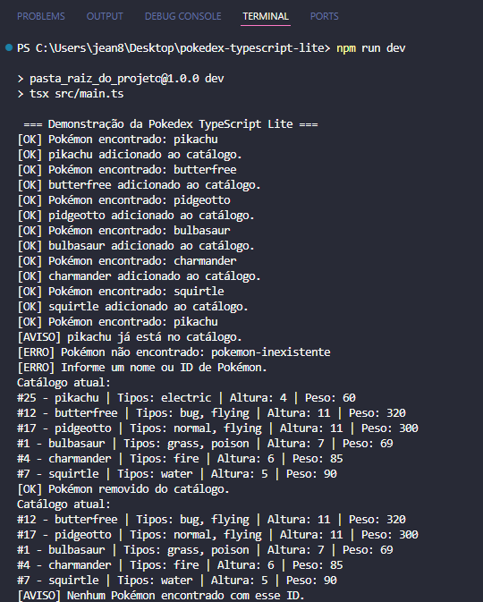

---

## Exemplo do arquivo pc_box.json

Após adicionar Pokémons ao catálogo, os dados ficam salvos no arquivo `pc_box.json`:
 
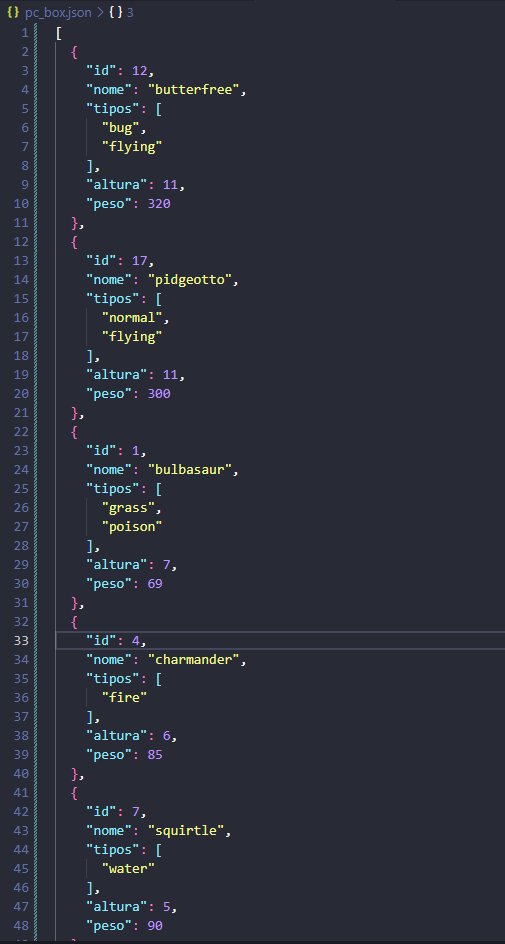 

## Observação importante sobre o `pc_box.json`

O projeto usa persistência local com o arquivo `pc_box.json`.

Isso significa que os Pokémon adicionados continuam salvos mesmo depois que a aplicação termina.

Por isso, se você executar o projeto mais de uma vez, alguns Pokémon podem já estar no catálogo, e a aplicação pode exibir mensagens de duplicidade.

Para testar a demonstração desde o início, deixe o arquivo `pc_box.json` com o seguinte conteúdo antes de executar:

```json
[]
```

---

## Exemplos de execução

### Exemplo 1 — Busca válida

Entrada testada no fluxo:

```txt
pikachu
```

Saída esperada:

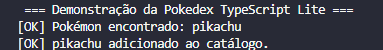

Ao listar o catálogo, a saída esperada inclui:

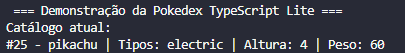

---

### Exemplo 2 — Adição dos Pokémon da demonstração

Entradas testadas no fluxo:

```txt
pikachu
butterfree
pidgeotto
bulbasaur
charmander
squirtle
```

Saída esperada:

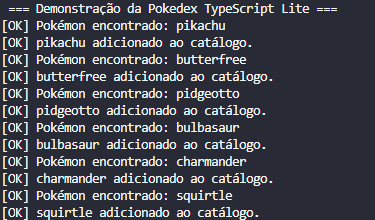

---

### Exemplo 3 — Duplicidade

Entrada testada no fluxo:

```txt
pikachu
```

O Pokémon `pikachu` é buscado uma segunda vez e enviado novamente para o catálogo.

Saída esperada:

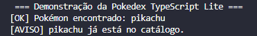

A duplicidade é verificada pelo `id` do Pokémon.

---

### Exemplo 4 — Busca inválida por Pokémon inexistente

Entrada testada no fluxo:

```txt
pokemon-inexistente
```

Saída esperada:

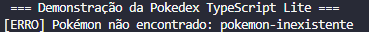

O sistema não quebra quando a busca falha. A função retorna `null`, e o Pokémon inválido não é adicionado ao catálogo.

---

### Exemplo 5 — Busca vazia

Entrada testada no fluxo:

```txt
  
```

Essa busca é usada para demonstrar o tratamento de uma entrada vazia ou inválida.

Saída esperada:

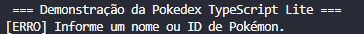

---

### Exemplo 6 — Listagem do catálogo

Depois de adicionar os Pokémon válidos, a listagem exibe os registros salvos no catálogo:

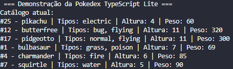

---

### Exemplo 7 — Remoção

Entrada testada no fluxo:

```txt
remover ID 25
```

Saída esperada:


Depois da remoção, o Pikachu não deve mais aparecer na listagem.

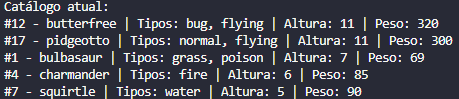

---

### Exemplo 8 — Remover Pokémon inexistente

Depois de remover o Pikachu, o fluxo tenta remover o ID `25` novamente.

Entrada testada:

```txt
remover ID 25 
```

Saída esperada:

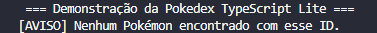

Esse teste demonstra que a aplicação trata corretamente a tentativa de remover um Pokémon que não está no catálogo.

---

## Demonstração de cenários de erro

Além dos testes principais da aplicação, alguns erros foram tratados no código, mas são mais difíceis de ocorrer naturalmente durante uma execução normal.

Por isso, estes cenários podem ser testados manualmente.

---

### 1. Pokémon inexistente

Este é o erro mais simples de testar, pois basta buscar um nome que não existe na PokeAPI.

Entrada testada no fluxo da aplicação:

```txt
pokemon-inexistente
```

Saída esperada:


Esse erro é tratado no arquivo:

```txt
src/services/pokeApi.ts
```

Quando a PokeAPI retorna uma resposta inválida, como status `404`, a aplicação cria um erro personalizado do tipo `APIError`.

O sistema não é interrompido. A função retorna `null`, e o Pokémon não é adicionado ao catálogo.

---

### 2. Busca vazia

A aplicação também testa uma busca sem conteúdo útil:

```txt
  
```

Esse caso serve para demonstrar que a função de busca deve validar o valor recebido antes de consultar a API.

Saída esperada:


Esse tratamento evita chamadas desnecessárias para a API e impede que entradas vazias sejam processadas como se fossem nomes válidos.

---

### 3. Erro genérico de conexão com a API

Esse erro pode acontecer se a aplicação não conseguir se comunicar com a PokeAPI.

Exemplos de causas:

```txt
- computador sem internet;
- API temporariamente indisponível;
- erro de rede;
- URL da API configurada incorretamente.
```

Forma manual de testar:

1. desconecte temporariamente a internet; ou
2. altere temporariamente a URL da API no arquivo `src/services/pokeApi.ts`.

Exemplo de alteração temporária:

```ts
const url = `https://pokeapi-url-invalida.co/api/v2/pokemon/${termoBusca}`;
```

Depois execute:

```bash
npm run dev
```

Saída esperada:

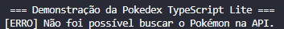

Após o teste, a URL deve ser restaurada para:

```ts
const url = `https://pokeapi.co/api/v2/pokemon/${termoBusca}`;
```

Observação: essa alteração é apenas para teste manual e não deve ser mantida no código final.

---

### 4. Arquivo `pc_box.json` não encontrado

A aplicação depende do arquivo `pc_box.json` para carregar e salvar o catálogo local.

Para testar o erro de leitura, renomeie temporariamente o arquivo:

```txt
pc_box.json
```

para:

```txt
pc_box_backup.json
```

Depois execute:

```bash
npm run dev
```

Saída esperada:

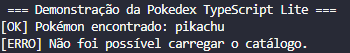

Esse erro é tratado no arquivo:

```txt
src/services/CatalogoPokemon.ts
```

A aplicação captura o problema e exibe uma mensagem clara no terminal, sem interromper o funcionamento geral do programa.

Após o teste, renomeie o arquivo novamente para:

```txt
pc_box.json
```

---

### 5. Arquivo `pc_box.json` com JSON inválido

Outro erro possível ocorre quando o arquivo `pc_box.json` existe, mas seu conteúdo não é um JSON válido.

Para testar, altere temporariamente o conteúdo de `pc_box.json` para algo inválido, por exemplo:

```txt
teste
```

Depois execute:

```bash
npm run dev
```

Saída esperada:

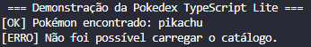

Isso acontece porque a aplicação tenta converter o conteúdo do arquivo usando `JSON.parse`.

Quando o conteúdo não é um JSON válido, o erro é capturado e tratado como um erro local do catálogo.

Após o teste, restaure o arquivo para um array JSON válido:

```json
[]
```

---

### 6. Erro ao salvar no `pc_box.json`

Esse erro é mais difícil de testar mas foi criado um tratamento para caso algum erro no salvamento ocorra.

Saída esperada:

```
[ERRO] Não foi possível salvar o catálogo.
```

---

## Persistência local com `pc_box.json`

O projeto utiliza o arquivo `pc_box.json` como uma base de dados local simples.

O arquivo fica na raiz do projeto e começa com um array vazio:

```json
[]
```

Quando um Pokémon é adicionado, a aplicação:

1. lê o conteúdo atual de `pc_box.json`;
2. transforma o JSON em um array de objetos;
3. verifica se o Pokémon já existe pelo ID;
4. adiciona o Pokémon ao array;
5. salva o array atualizado novamente no arquivo.

Exemplo de conteúdo do `pc_box.json` após adicionar Pokémon:

```json
[
  {
    "id": 25,
    "nome": "pikachu",
    "tipos": [
      "electric"
    ],
    "altura": 4,
    "peso": 60
  }
]
```

Como os dados ficam salvos no arquivo, executar o projeto mais de uma vez pode gerar avisos de duplicidade.

Para testar o fluxo desde o início, basta alterar o conteúdo de `pc_box.json` novamente para:

```json
[]
```

---

## Explicação dos principais arquivos

### `src/main.ts`

É o ponto de entrada da aplicação.

Ele cria uma instância de `TerminalController` e inicia a demonstração do funcionamento do projeto.

Exemplo:

```ts
const controller = new TerminalController();
await controller.executarDemonstracao();
```

---

### `src/controllers/TerminalController.ts`

É a camada responsável por organizar o fluxo demonstrado no terminal.

Ela não cria menu interativo e não recebe dados digitados pelo usuário.

Sua função é coordenar a sequência de chamadas:

* buscar Pokémon;
* adicionar ao catálogo;
* testar duplicidade;
* testar busca inválida;
* testar busca vazia;
* listar catálogo;
* remover Pokémon;
* testar erro de remoção;
* listar novamente.

---

### `src/models/Pokemon.ts`

Contém as interfaces utilizadas no projeto.

A interface `PokemonResumo` representa o formato simplificado do Pokémon dentro da aplicação.

Exemplo:

```ts
export interface PokemonResumo {
  id: number;
  nome: string;
  tipos: string[];
  altura: number;
  peso: number;
}
```

A interface `PokemonApiResponse` representa apenas os campos da resposta da PokeAPI que o projeto utiliza.

---

### `src/models/CustomErrors.ts`

Contém classes de erro personalizadas.

Foram criados dois tipos de erro:

* `APIError`: usado para erros relacionados à busca na PokeAPI;
* `LocalBoxError`: usado para erros relacionados ao arquivo local `pc_box.json`.

Essas classes ajudam a separar erros de origem externa, como falhas de API, de erros locais, como problemas de leitura ou escrita no arquivo JSON.

---

### `src/services/PokeApi.ts`

Contém a função assíncrona `buscarPokemon`.

Essa função:

1. recebe um nome ou ID;
2. valida a entrada recebida;
3. consulta a PokeAPI usando `fetch`;
4. trata erro quando o Pokémon não existe;
5. transforma a resposta da API em um objeto `PokemonResumo`;
6. retorna o Pokémon simplificado ou `null`.

Exemplo de assinatura:

```ts
export async function buscarPokemon(nomeOuId: string): Promise<PokemonResumo | null>
```

---

### `src/services/CatalogoPokemon.ts`

Contém a classe `CatalogoPokemon`.

Essa classe é responsável por gerenciar o catálogo local de Pokémon.

Ela possui métodos para:

* adicionar Pokémon;
* listar Pokémon;
* remover Pokémon;
* carregar dados do `pc_box.json`;
* salvar dados no `pc_box.json`.

Os métodos principais são:

```ts
adicionar(pokemon: PokemonResumo): Promise<void>
listar(): Promise<void>
remover(id: number): Promise<void>
```

---

### `src/utils/formatarPokemon.ts`

Contém uma função utilitária responsável por formatar a exibição de um Pokémon no terminal.

Exemplo:

```ts
export function formatarPokemon(pokemon: PokemonResumo): string
```

Essa função recebe um objeto `PokemonResumo` e retorna uma string formatada.

Ela foi separada em `utils` para evitar que a classe `CatalogoPokemon` fique responsável por montar manualmente o texto de exibição.

---

## Conceitos aplicados

### TypeScript

O projeto utiliza TypeScript para tipar:

* objetos;
* parâmetros de funções;
* retornos de funções;
* arrays;
* respostas da API;
* métodos de classe.

Exemplo:

```ts
async function buscarPokemon(nomeOuId: string): Promise<PokemonResumo | null>
```

---

### Interfaces

As interfaces descrevem o formato esperado dos dados.

A interface `PokemonResumo` define o objeto usado internamente pela aplicação.

A interface `PokemonApiResponse` define os campos da resposta da PokeAPI que serão utilizados.

---

### Fetch e async/await

A aplicação usa `fetch` para consultar a PokeAPI.

Como a consulta depende de uma resposta externa pela internet, a função de busca é assíncrona e utiliza `async/await`.

---

### Tratamento de erros

A aplicação usa `try/catch` para evitar que erros interrompam o programa.

Também foram criadas classes de erro personalizadas:

* `APIError`;
* `LocalBoxError`.

Com isso, o sistema consegue exibir mensagens mais claras dependendo da origem do erro.

---

### Métodos de array

O projeto utiliza métodos de array em diferentes partes:

* `map`: transforma os tipos da API em uma lista de strings;
* `some`: verifica se um Pokémon já existe no catálogo;
* `filter`: remove um Pokémon pelo ID;
* `forEach`: lista os Pokémon salvos.

Exemplo de uso de `map`:

```ts
const tipos = dados.types.map((item) => item.type.name);
```

Exemplo de uso de `some`:

```ts
const existe = catalogo.some((pokemon) => pokemon.id === id);
```

Exemplo de uso de `filter`:

```ts
const catalogoAtualizado = catalogo.filter((pokemon) => pokemon.id !== id);
```

Exemplo de uso de `forEach`:

```ts
catalogo.forEach((pokemon) => {console.log(formatarPokemon(pokemon))});
```
---

### Classes

O projeto utiliza classes para organizar responsabilidades.

A classe `CatalogoPokemon` gerencia o catálogo local.

A classe `TerminalController` organiza o fluxo de demonstração da aplicação.

---

### Modificadores de acesso

A classe `CatalogoPokemon` utiliza métodos privados para esconder detalhes internos da leitura e escrita do arquivo.

Exemplo:

```ts
private async carregarCatalogo(): Promise<PokemonResumo[]>
```

Esse método é privado porque apenas a própria classe precisa saber como o arquivo `pc_box.json` é lido.

---

## Organização do Kanban

O quadro Kanban foi utilizado para organizar as etapas do desenvolvimento.

Colunas sugeridas:

* Backlog
* A Fazer
* Em Andamento
* Concluído

Link do Kanban: 

```txt
https://trello.com/invite/b/6a21beac991d72488cf5e288/ATTI94339c0bec9dbca62072effb9d48289dDE3E457F/pokedex-typescript-lite
```

 

---

## Branches utilizadas

Branches utilizadas no desenvolvimento:

* `main`
* `developer`
* `feat/models-Pokemon`
* `feat/api-pokemon`
* `feat/Catalogo`
* `feat/Models-CustomErrors`
* `feat/pokeApiImproved`
* `feat/utils-formatarPokemon`
* `feat/refatorarCatalogo`
* `feat/CatalogoAssincrono`
* `feat/TerminalController`
* `docs/readme`
---

## Exemplos de commits

Exemplos de commits utilizados:

```txt
add: adicionado arquivo .gitignore
add: adicionado arquivos de configuração do projeto
chores: definido file layout
chore: definido scripts dev, build e start
add: adicionado arquivo de armazenamento local
fix: ajuste de "types" e "verbatimModuleSyntax" para importações
feat: cria interfaces PokemonResumo e PokemonApiResponse
feat: configura projeto com typescript
feat: cria interfaces de pokemon
feat: implementa busca na PokeApi
feat: implementa classe CatalogoPokemon c/ armazenamento durante execução
fix: typos em main e PokeApi
feat: finaliza versao minima em memoria
feat: cria erros personalizados
feat: cria utilitario para formatar pokemon
refactor: utilitario na listagem do catalogo
feat: adiciona persistencia local atraves do CatalogoPokemon
add: comentarios no Catalogo
refactor: move fluxo principal para terminal controller
docs: cria readme com instrucoes
```

---

## Melhorias futuras

Algumas melhorias possíveis para versões futuras:

* criar menu interativo no terminal;
* permitir que o usuário escolha qual Pokémon buscar;
* criar filtros por tipo de Pokémon;
* exibir mais estatísticas, como HP, ataque e defesa;
* funcionalidade de sort por ID ou Nome no Catálogo;
* validar de forma mais rigorosa o conteúdo de `pc_box.json`;
* criar testes automatizados;
* criar uma API própria com Express.
